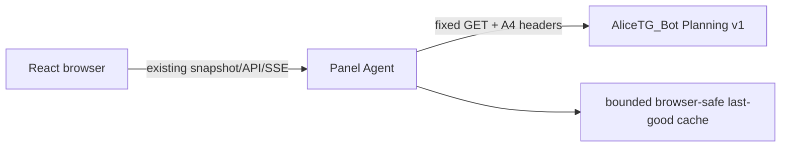

# Planning Panel Agent adapter — B1

Status: implementation branch only; read-only and feature-gated.

Base contract: AliceTG_Bot merged commit `15fd1e433254834732f332b0169697bca18cc094`.
Control Center base: `bc3f764e2c623944f146c3903f2a17983e3a3072`.

B1 adds the transport and contract boundary for future Planning surfaces. It
does not start B2, add a visible card or route navigation, perform Planning
writes, change AliceTG_Bot/Home Assistant, or deploy to a panel machine.

## Boundary



The browser only receives the normalized `planning.panel.v1` projection. It
never receives `INTERNAL_WEBHOOK_SECRET`, `PLANNING_PANEL_AGENT_SECRET`, the
Alice HMAC secret, Telegram/TickTick credentials, calendar credentials, or an
arbitrary backend URL.

## Feature gate and configuration

`PANEL_PLANNING_ENABLED` defaults to `false`. When it is off, Panel Agent does
not construct an authenticated Planning client, does not poll, and emits the
existing snapshot shape with `planning: null`.

When enabled, all connection values are server-side settings and are required:

| Setting | Default | Meaning |
| --- | --- | --- |
| `PANEL_PLANNING_BASE_URL` | empty | `http`/`https` origin only; no credentials, path, query, or fragment |
| `PANEL_PLANNING_INTERNAL_SECRET` | empty | A4 `X-Internal-Secret` |
| `PANEL_PLANNING_SECRET` | empty | A4 panel-agent audience secret |
| `PANEL_PLANNING_REFRESH_SECONDS` | `20` | coordinated domain poll; clamped to 5–300 seconds |
| `PANEL_PLANNING_STATUS_REFRESH_SECONDS` | `300` | slow A8 health/status poll; clamped to 60–3600 seconds |
| `PANEL_PLANNING_STALE_AFTER_SECONDS` | `90` | freshness threshold |
| `PANEL_PLANNING_UNAVAILABLE_AFTER_SECONDS` | `300` | offline threshold |
| `PANEL_PLANNING_MAX_BACKOFF_SECONDS` | `120` | bounded failure backoff |
| `PANEL_PLANNING_CACHE_PATH` | `.cache/planning-snapshot.json` | server-only cache path |
| `PANEL_PLANNING_RESPONSE_LIMIT_BYTES` | `262144` | hard upstream response cap |
| `PANEL_PLANNING_TIMEZONE` | `Europe/Moscow` | deterministic local-day query timezone |
| `PANEL_PLANNING_FIXTURE_SCENARIO` | `healthy` | fixture-mode scenario only |

Missing enabled credentials or an unsafe base URL fails closed during server
configuration. Credentials are never part of a Pydantic response model, typed
snapshot, cache document, or fixture.

## Upstream A4 reads

The client has no generic request, proxy, arbitrary method, arbitrary header,
or path argument. Its only routes are:

```text
GET /internal/planning/v1/reminders
GET /internal/planning/v1/tasks
GET /internal/planning/v1/events
GET /internal/planning/v1/projects
GET /internal/planning/v1/status
```

Every request carries exactly the server-owned boundary:

```text
X-Internal-Secret: <PANEL_PLANNING_INTERNAL_SECRET>
X-Planning-Audience: panel-agent
X-Planning-Secret: <PANEL_PLANNING_SECRET>
```

The adapter uses the documented A4 queries only: `state/from/to/limit/offset`
for reminders, `view=today|overdue|upcoming` for tasks, a bounded explicit UTC
range for events, and the first bounded projects page. It never calls
`POST`, `PATCH`, `DELETE`, complete/cancel/archive actions, or
`/alice/interpret`.

Responses are streamed into a bounded byte buffer, duplicate JSON fields are
rejected, and `planning.v1`/`planning.operations.v1` models use `extra="forbid"`.
UUIDv4, UTC timestamp, IANA timezone, enum, date-only/timed task, and all-day/
timed event shapes are validated before projection.

## Bounded normalized projection

The dashboard contract is `planning.panel.v1`:

```text
planning:
  schemaVersion
  generatedAt
  sourceStatus: current | stale | offline | degraded
  lastSyncedAt
  staleAfter
  reminders: upcoming[], overdue[], deliveryFailures[]
  tasks: today[], overdue[], upcoming[], projects[]
  calendar: today[], upcoming[], conflicts[]
  capabilities: create/edit/complete/cancel/delete/voice/providerSync
  providerStatuses[]
```

Every reminder, task, event, and project remains a distinct typed object. Each
retains a stable UUID, integer version, canonical source/source label, and
canonical timestamps/status. Notes, upstream audit correlation IDs, provider
receipts, and other unnecessary fields are not projected.

Each global list is capped at 20 items. This is below the A4 maximum page size
of 100. The adapter makes one bounded page request per fixed view/range and
does not follow `has_more` indefinitely. Event ranges are local-day today plus
a seven-day bounded upcoming window; no relative strings are stored.

## Polling and source state

There is one coordinator task, not one task per object/domain. Startup performs
one status read and one domain refresh. Domain refreshes use configurable
exponential backoff with injected jitter; shutdown cancels and awaits the task.

`GET /status` is deliberately not part of every fast domain poll. A8 health
status performs a full SQLite integrity check, so status is refreshed on the
300-second default cadence and after reconnect. Fast domain polls preserve the
last status observation.

The source state machine is:

- `current`: the bounded domain read completed successfully and the preserved
  status is healthy.
- `degraded`: one bounded domain read failed while usable data remains, or the
  slow status reports meaningful degraded health.
- `stale`: a last-good projection is older than the stale threshold but has not
  crossed the unavailable threshold.
- `offline`: no usable cache exists, or an unavailable upstream/cache has
  crossed the offline threshold.

After restart, a valid cache is never labeled current before a successful live
refresh. Offline restart retains bounded cache objects with `stale` or
`offline`; without a valid cache it returns useful empty `offline` state.

## Last-good cache

The cache document is schema-versioned and contains only the normalized
projection plus a bounded save timestamp. It has no credentials, auth headers,
raw upstream JSON, notes, receipts, or provider data. Reads reject missing,
corrupt, oversized, or newer cache documents. Writes use a same-directory
temporary file, flush/fsync where available, restrictive `0600` permissions,
and atomic `replace`. The configured maximum is 256 KiB by default.

## Snapshot revision and SSE

Planning is passed into the existing `SnapshotPublisher`. There is no second
Planning SSE/WebSocket stream. The publisher's normal semantic fingerprint
includes bounded Planning objects and source/capability/provider state, while
excluding `generatedAt`, `lastSyncedAt`, `staleAfter`, provider observation
timestamps, and other technical observation fields.

Therefore unchanged Planning semantics, timestamp-only polls, and unchanged
cache rewrites do not increment the normal dashboard revision. Added/removed
objects, canonical version/content or delivery-state changes, and
`current`/`stale`/`offline`/`degraded` transitions do increment it and emit the
normal `/api/v1/events` snapshot notification.

## Same-origin read routes

The canonical B1 routes follow the existing versioned Panel Agent convention:

```text
GET /api/v1/planning/status
GET /api/v1/planning/reminders
GET /api/v1/planning/tasks
GET /api/v1/planning/events
GET /api/v1/planning/projects
```

The unversioned `/api/planning/...` spelling is a narrow compatibility alias;
both surfaces use the same normalized adapter. Query names, limits, offsets,
views, and date ranges are independently allowlisted and bounded. Unknown
query fields, repeated fields, arbitrary URLs, and oversized ranges are
rejected. There are no Planning write routes, raw routes, or proxy routes.

Read routes follow the existing monitor/read policy. B1 panel capabilities are
all `false` for `create`, `edit`, `complete`, `cancel`, `delete`, `voice`, and
`providerSync`, even though A4 metadata describes server-side mutation
support. Native events are represented as local-only; no TickTick/calendar
provider network calls are made.

## Fixtures and rollout

`PlanningFixtureTransport` is deterministic and synthetic. It covers healthy,
empty, reminders, today/overdue/upcoming tasks, events, projects, delivery
failure, degraded status, timeout, malformed JSON, incompatible schema, offline,
and oversized response states. It is used only in fixture/integration-test
modes and contains no production titles or IDs.

B1 rollout is disabled by default and has no production action. After review,
merge, and a separately approved rollout, enable the Panel Agent gate with
server-managed synthetic/staging credentials first, observe the read-only
projection, and roll back by disabling the gate. Do not contact
`control-panel-pc`, deploy to Samsung, enable `PLANNING_API_ENABLED` in
AliceTG_Bot, or perform Planning writes as part of B1.

The separate operational debt remains:

```text
PERIODIC_BACKUP_SCHEDULER_PENDING
```

It is not a B1 blocker.
