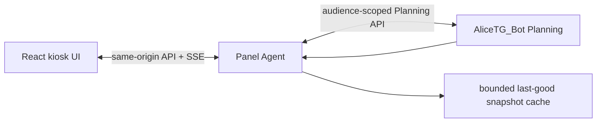

# Artem Control Center planning integration

Date: 2026-08-11

Scope: issue #61, Plan 2; starts only after the independent Plan 1 proof

## Product outcome

Control Center becomes the touch-first monitoring and editing surface for three visibly distinct concepts:

- **Напоминания:** due at an exact time, with delivery state and retry/failure visibility.
- **Задачи:** work that may be due, prioritised, assigned to a list and completed.
- **Планы:** all-day or timed calendar events, preserving provider/calendar identity.

They share shell primitives and a Planning API but never collapse into one generic text list. The canonical Samsung target is **1280 × 720 CSS px**, touch, no hover, no physical keyboard. The UX fixes in the tablet audit are prerequisites, not cleanup after the new routes become dense.

## Integration boundary

The browser continues to talk only to Panel Agent. Add a Planning client/adapter to Panel Agent, merge the planning projection into its existing snapshot, and use the existing snapshot revision + SSE update path. Do not expose the bot's internal secret, TickTick OAuth token or calendar credential to React.



Panel Agent polls Planning on startup, after a local mutation, and at a short configurable interval; it increments the normal snapshot revision only when the canonical projection changes. A dedicated second browser event stream is unnecessary. Backoff and jitter protect the bot when offline.

## Frontend contract

Extend the existing frontend snapshot types and fixtures with a versioned `planning` block:

```text
planning:
  schemaVersion
  generatedAt
  sourceStatus: current | stale | offline | degraded
  lastSyncedAt
  staleAfter
  reminders: upcoming[], overdue[], deliveryFailures[]
  tasks: today[], overdue[], upcoming[], projects[]
  calendar: today[], upcoming[], conflicts[]
  capabilities: create/edit/complete/cancel/delete/voice/providerSync
  providerStatuses[]
```

Lists are deliberately bounded in the global snapshot. Route pagination/range queries use narrow same-origin Panel Agent endpoints. Objects always include stable ID, integer version, source/source label and canonical timestamps. Mutations require an idempotency key and expected version and return the complete canonical object.

Suggested same-origin endpoints mirror domain operations rather than proxying arbitrary URLs:

```text
GET/POST/PATCH /api/planning/reminders...
GET/POST/PATCH /api/planning/tasks...
GET/POST/PATCH /api/planning/events...
POST           /api/planning/parse
GET            /api/planning/status
```

The Agent validates again and maps only these operations to Planning. It rejects arbitrary path suffixes, external URLs, HA services/entities and unknown fields.

## Information architecture

### Overview

Replace the three tall placeholder “today” cards with one compact **Дела** card while reducing the oversized coffee card. The first 720 px viewport must include:

- coffee state and its primary action;
- next reminder, with `через 40 мин` and exact time accessible in details;
- overdue task count and the highest-priority due task;
- next calendar event, distinguishing all-day from timed;
- one combined degraded/stale indicator if any planning source is unhealthy.

The card links each row to the relevant route and shows at most one item per domain plus counts. It does not become a mini task manager. Weather, service incidents and backups retain compact summaries below; the weather hero must not be copied into Overview.

### Tasks route

Use a segmented, touch-sized selector: **Сегодня / Просрочено / Скоро**. Projects/lists are an optional filter sheet, not a permanent narrow sidebar. Each row shows a completion target, title, due label, priority and project only when present. Completed items leave the active view with an undo notice; provider conflicts remain visible and cannot be dismissed as success.

Primary operations:

- tap checkbox/complete target (at least 48 px);
- tap row for edit sheet;
- add via 56 px primary action;
- archive/delete only inside details, separated from Complete;
- bulk operations are out of the first release.

### Calendar route

Start with **Сегодня** and **Повестка**. A seven-day strip may be added only if it fits the measured viewport without shrinking text; a full month grid is not a first-tablet priority. Timed events align to time, all-day events remain a separate band, and overlaps receive a compact conflict marker. Provider/calendar identity appears in details and as a small accessible colour+text marker when multiple calendars exist.

Create/edit supports all-day, start/end, timezone display, title and optional notes/location. A start without an end previews the 60-minute default. Recurrence controls stay hidden until the chosen provider passes round-trip tests.

### Reminder surface

Use a dedicated sheet or section reached from Overview and Tasks navigation context; do not disguise reminders as tasks. Views are **Скоро / Пропущено / Доставка**. Each item shows relative and exact due time, status and delivery state. Complete, snooze and cancel are separate actions; destructive Cancel is not adjacent to Snooze without spacing.

Whether reminders deserve a permanent rail route should be decided after usage data. The first release can use the Overview card + a full-screen reminder view without adding an eleventh rail item.

## Touch-only creation and editing

Use a bottom/full-screen sheet sized to remain stable when the Windows OSK appears. The normal flow must be completable without typing:

1. Tap microphone and speak only the cumbersome title/phrase, or tap optional text fallback.
2. Show the transcript, chosen domain and parsed structured values.
3. Adjust date, time, all-day, priority and project with 48–56 px touch widgets.
4. Display a natural-language restatement.
5. Save only after explicit confirmation.

Use calendar/date wheels or a large date grid, preset chips (`Сегодня`, `Завтра`, `Через неделю`), time chips plus a touch time picker, `−/+` where numeric adjustment is appropriate, and segmented priority controls. Do not make Enter/Escape or keyboard shortcuts required. Back/cancel is always visible and preserves no phantom optimistic object.

The domain picker is explicit when the utterance is ambiguous. Parser uncertainty highlights only the affected fields and disables Save until resolved. An LLM confidence score never replaces this interaction.

## Samsung voice input recommendation

### Hardware finding

The real Samsung has an i7-7500U (2C/4T), 8 GB RAM and Intel HD 620, with no CUDA GPU. Edge Stable is 151.0.4129.72.

### Options evaluated

1. **Browser/Windows speech:** Edge's documented on-device Speech Recognition availability is currently Canary/Dev 150+ and supports only `en-US`, `de-DE`, `it-IT`, `pt-PT`, `es-ES` and `ko-KR`; Russian is absent. Cloud browser recognition is implementation/network dependent and unsuitable as the only kiosk path. Source: [Microsoft Edge Speech Recognition API](https://learn.microsoft.com/en-us/microsoft-edge/web-platform/speech-recognition-api).
2. **Local Whisper:** `whisper.cpp` supports CPU inference, quantisation and Intel/OpenVINO paths. Official approximate memory is 273 MB tiny, 388 MB base, 852 MB small and 2.1 GB medium. Source: [whisper.cpp](https://github.com/ggml-org/whisper.cpp). `faster-whisper` has no useful CUDA advantage on this machine.
3. **Reuse Alice/HA:** the current Alice custom skill is excellent remote ingress but does not provide a direct microphone/transcript session from the kiosk browser. Making the user address a separate speaker while editing a tablet sheet adds latency and ambiguous focus.

### Recommendation

Prototype **feature-flagged, on-demand whisper.cpp base multilingual Q5** as a Panel Agent companion/subprocess. Keep it unloaded when idle, cap at four CPU threads, record only while pressed, delete audio immediately after transcription and never include it in backups. Target a 5–8 second Russian utterance at ≤3 seconds p95 transcription; measure CPU, peak RAM, thermals and Edge responsiveness on the real Samsung. Test `small` only if base accuracy fails and the same performance gates pass. Do not install anything during the audit or default-enable before the benchmark.

If the pilot fails quality/latency, use explicit opt-in network speech with a privacy/network badge or retain text as a fallback. In all cases voice fills the title/phrase only; touch controls own structured fields, and transcript + parsed values require confirmation.

## State and failure behavior

Every domain implements the audit's fixture matrix: loading, empty, current, due soon/today, overdue, completed/cancelled, stale, degraded, offline with/without cache, mutation pending, optimistic conflict, parsing ambiguity, delivery retrying and terminal failure.

| State | Display | Mutations |
| --- | --- | --- |
| Current | normal data, quiet last-sync in details | enabled per capability/access |
| Stale cache | persistent `Данные от HH:MM` chip | disabled initially; offer refresh |
| Offline with cache | last-good data, no false live relative countdown | disabled; exact timestamps remain |
| Offline without cache | useful empty/error explanation and retry | disabled |
| Provider degraded | local data remains; provider badge and queued sync count | local mutations allowed only when durable outbox exists |
| Version conflict | current server object + user's proposed change | no silent overwrite; reload/resolve |
| Delivery retrying/failed | explicit icon, next attempt/failure detail | manual retry if authorised |

Relative times update locally only while source data is current and the system clock is sane. Once stale, freeze the semantic label or render `срок был HH:MM`, never a reassuring live countdown over stale data.

## Access, confirmations and notices

- Read/monitor follows the existing route access policy.
- Create/edit/complete/snooze may use elevated/full access according to the current catalog; destructive cancel/delete requires a custom confirmation with the object title/time.
- Provider connection/disconnection and conflict overwrite are strong operations. Replace typed English phrases on the kiosk with PIN + target-specific hold confirmation, subject to the security review recorded in the UX audit.
- Replace `window.confirm` and independent fixed notices first. Planning uses the one global notice stack with correlation IDs and Undo where semantically safe.
- Do not announce a mutation as saved until the server returns the canonical object. Offline queued mutations are a later explicit capability, not a hidden optimistic promise.

## Motion and visual constraints

Preserve the current visual identity. Planning rows may use short opacity/transform entry transitions only when they do not move a touch target under the finger. No continuous ambient animation is added. Reduced motion removes nonessential transitions; low-performance and battery modes do the same and avoid blur-heavy sheets. Dialog content itself does not animate behind an overlay.

At 1280 × 720:

- all visible interactive targets are at least 48 × 48 px, primary/destructive 56 px where space permits;
- essential status/due/freshness text is at least 12 px;
- dialogs/sheets fit without trapping the viewport and keep actions visible;
- Russian titles wrap to two lines with predictable row expansion/truncation;
- no document horizontal overflow; only declared local scrollers may overflow;
- fixed notices, access badge, dialogs and OSK-safe sheets have nonintersecting boxes.

## Likely Control Center files/modules

Use the discovered architecture rather than introducing a second framework:

- Panel Agent API/model/snapshot modules under `apps/panel_agent/` and their existing integration client pattern.
- React routes, shell, providers and widgets under `apps/dashboard/src/`.
- `apps/dashboard/src/App.tsx` for replacing `PlaceholderPage` routes.
- existing widget registry, access policy/catalog and `ActionConfirmationProvider` rather than route-local permission code.
- `apps/dashboard/src/RuntimeControls.tsx` and confirmation catalog for eliminating native confirmation.
- shared CSS/theme/motion modules for canonical viewport adjustments and notice stack.
- existing fixtures and Playwright suites for state/viewport coverage.

Exact filenames for new planning modules should follow neighbouring weather/HA integration naming discovered at implementation time, but the API/domain boundaries above are fixed.

## Testing strategy

### Contract and unit

- shared JSON fixture/contract tests between Planning and Panel Agent;
- timezone/date-only/all-day serialization, version conflicts and capability gating;
- snapshot hashing does not emit SSE revisions for unchanged polls;
- secrets and provider tokens never serialize to frontend/log fixtures.

### Component and accessibility

- every view/state with long Russian strings;
- 48 px target and 12 px essential-text assertions;
- keyboard-free `.tap()` paths for create/edit/complete/cancel;
- focus trapping and OSK viewport behavior as accessibility fallbacks;
- reduced/low-performance/battery motion assertions.

### Playwright on the canonical target

Run at 1280 × 720, device scale factor 1.5, touch enabled:

- Overview first-viewport intersection tests;
- Tasks/Calendar/Reminders CRUD with mock Planning server;
- live SSE refresh and no duplicate rows;
- stale/offline/degraded/retry/conflict flows;
- simultaneous access + connectivity + planning notices collision check;
- typed browser prompts stubbed to throw;
- DOM `scrollWidth`, bounding-box collision and viewport assertions;
- day/night and all four motion/performance modes.

### Real Samsung integration

After local gates, deploy canary read-only first. Verify Edge memory/CPU, touch hit rate, scroll behavior, long Russian titles, network disconnect/recovery and Panel Agent/bot health. Mutations are enabled per-domain only after read-only soak and restore-tested backend rollout.

## Rollout and rollback

1. Ship shared UX primitives and layout corrections with no Planning dependency.
2. Ship disabled Planning client and fixture tests.
3. Enable Panel Agent read-only adapter; expose status to operators, not navigation.
4. Enable Overview and route monitoring behind separate flags.
5. Enable reminder, task and local-event mutations separately after Plan 1 health gates.
6. Pilot voice for one operator/device; never couple basic touch creation to voice availability.
7. Enable TickTick and calendar adapters separately after their stop points.

Each flag rolls back independently to the last-good UI. Panel Agent retains a bounded cache but clearly marks it stale. Rolling back the browser must not roll back Planning schema or discard queued deliveries/provider changes.

## Acceptance for Plan 2

- The complete Overview planning summary is visible with coffee at 1280 × 720 without scrolling.
- Reminder/task/calendar monitoring behaves distinctly and accurately in all required states.
- Normal CRUD is touch-completable without keyboard; the optional text search/input never blocks the flow.
- Panel receives updates through the existing SSE revision stream and creates no duplicate items.
- Offline/stale/provider failure never appears as successful live state.
- No browser transcript can address HA services/entities, commands, paths or arbitrary network destinations.
- Voice pilot meets the real-device latency/resource/accuracy gates or remains disabled.
- TickTick/calendar badges reflect proven capabilities rather than promised real-time sync.

## USER DECISION / STOP points

- Choose the authoritative calendar provider and calendar before provider credentials or writes.
- Approve/complete TickTick developer app registration and OAuth pilot before sync work.
- Decide the user's meaning of “вечером”; until then require date/time clarification.
- Decide whether Reminders earns a permanent navigation item after monitoring usage; do not add it speculatively.
- Approve local microphone processing and audio-retention policy before the real-device voice pilot (recommended retention: none).
