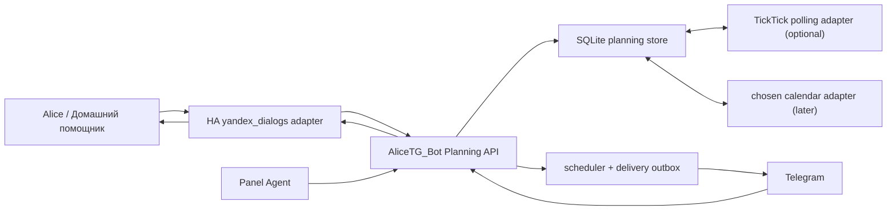

# Home Assistant personal assistant foundation

Date: 2026-08-11

Scope: issue #61, Plan 1 only; no production implementation in this branch

## Decision summary

The first implementation belongs in `AliceTG_Bot`, with Home Assistant as the Alice ingress/response adapter. Use a dedicated SQLite planning store inside the existing always-on bot deployment; do not make HA state, automations, JSON files, TickTick, or the Samsung browser authoritative.

| Domain | Authoritative source | External relationship |
| --- | --- | --- |
| Custom reminders | Planning SQLite store | Telegram is a delivery channel; Alice and Samsung are clients |
| Tasks | Planning SQLite store | TickTick may become an eventually consistent projection/import after an OAuth pilot |
| Calendar events | Selected calendar provider after user approval | Until then, local-only draft/events live in Planning and are visibly marked unsynchronised |

Home Assistant receives `yandex_intent`, forwards a narrow structured command to Planning, and returns `yandex_intent_response`. `AliceTG_Bot` owns persistence, parsing, scheduling, delivery, Telegram interaction, audit, and the internal API. This is a module boundary inside the existing bot first, not a new deployable service.



## Verified current environment

### Home Assistant and Alice

The inspected configuration is `/Users/aartemida/Documents/Homeassistant/HomeAssistant_Server_Config`. The running HA version is 2026.4.4 and its configured timezone is `Europe/Moscow`.

The actual community integrations are:

- `yandex_dialogs` 1.3.2: receives a published Yandex Dialog skill as `yandex_intent` events and can answer through `yandex_intent_response`.
- `yandex_station` 3.21.4: controls station media/dialog playback. Existing automations use `media_content_type: dialog:домашний помощник:<dialog>`.

The current reminder automation matches any `yandex_intent` containing variants of “напом” and “через”, POSTs only `text`, `intent` and `dialog` to `/internal/reminders/alice-create`, then speaks through the remembered station. The bot parser supports only integer minute/hour offsets plus “час” and “полчаса”, with a 1-minute to 24-hour limit.

This is our custom skill path only. There is no evidence that the integrations expose Alice's native reminder database. Therefore:

- “Алиса, напомни мне…” remains a Yandex-owned reminder and is out of scope.
- “Алиса, скажи домашнему помощнику…” enters our Planning system and may appear in Control Center and Telegram.

The supported response path is the `yandex_dialogs` response event, preserving the Yandex session/application/user fields. Station media playback may remain a compatibility fallback but must not be the normal conversational contract.

Primary integration sources: [YandexDialogs](https://github.com/AlexxIT/YandexDialogs) and [YandexStation](https://github.com/AlexxIT/YandexStation).

### Existing AliceTG_Bot boundary

The inspected checkout is `/Users/aartemida/Documents/Homeassistant/TG_Alisa_Assistant_Bot`. It already owns Telegram authentication, internal-secret authentication, HA calls, an HTTP server, reminder parsing and restart recovery. Relevant modules are:

- `app/services/reminder_store.py`
- `app/services/reminder_parser.py`
- `app/workflows/reminders.py`
- `app/web/internal_routes.py`
- `app/handlers/reminders.py`
- `app/keyboards/reminders.py`
- `app/messages/reminders.py`
- `app/main.py`, `app/config.py`
- associated `tests/`

Current persistence is one JSON file with 12-character UUID fragments and statuses `pending`, `fired`, `cancelled`. The scheduler creates `asyncio.sleep` tasks and restores pending/overdue records on startup. A reminder is marked fired if at least one delivery channel succeeds. If all channels fail, it remains pending but its in-memory task is removed, so it is not retried until another process restart. The new scheduler/outbox must replace this failure mode before expanding creation surfaces.

The checkout is clean on `feat/control-center-ha-timing` at `75cb62d`, tracking its remote branch, but it is three commits behind `origin/main`. Reconciliation with current main is a required stop point before implementation; do not reset or discard the branch.

### Calendar evidence

No Google Calendar, iCloud, Exchange or CalDAV integration was found. HA exposes only `todo.shopping_list`; two `yandex_station` calendar entities are disabled and are not evidence of an authoritative personal calendar. Provider choice, credentials, write semantics and destination calendar are a **USER DECISION / STOP** before any provider writes.

## Domain model

All timestamps crossing API/storage boundaries are RFC 3339 UTC with a separate IANA timezone. Human-relative labels are presentation only. IDs are UUIDv4 generated once by Planning. Every table has `created_at`, `updated_at`, integer `version`, optional `deleted_at`, `source`, `source_ref`, and immutable `audit_correlation_id` where applicable.

### Reminder

Required fields:

```text
id, title, notes?, due_at_utc, timezone, status
source, source_ref?, created_by, completed_at?, cancelled_at?
delivery_state, next_attempt_at?, final_failure_at?, version
```

`status`: `pending | due | completed | cancelled`. `delivery_state`: `not_due | queued | retrying | delivered | failed`. Delivery is separate from completion: a reminder can be delivered yet remain uncompleted. Cancel is a tombstone, not a physical delete.

### Task

```text
id, title, notes?, due_date?, due_time?, timezone?
priority, project_id?, status, completed_at?, archived_at?
source, source_ref?, version
```

`priority`: `none | low | normal | high`. `status`: `open | completed | archived`. A due date without time must remain date-only; it must not be silently converted into midnight. Projects have stable internal IDs and optional provider mappings.

### Calendar event

```text
id, title, notes?, location?, all_day
start_at_utc?, end_at_utc?, start_date?, end_date_exclusive?
timezone, recurrence_rule?, provider_id?, provider_calendar_id?
sync_state, source, source_ref?, version
```

Timed and all-day representations are mutually exclusive. All-day end dates are exclusive. When a user supplies a start but no end, the documented default duration is 60 minutes and must be repeated in the confirmation. Recurrence remains disabled until the selected provider's round-trip behavior is tested.

### Supporting records

- `idempotency_keys`: unique `(audience, key)`, request hash, stored response, expiry.
- `delivery_attempts`: reminder, channel, attempt number, status, started/finished/error, provider receipt.
- `outbox`: durable jobs with lease owner/expiry, next attempt, attempts, payload version.
- `audit_events`: actor, surface, action, object/version, redacted before/after, correlation ID.
- `provider_mappings`: domain, internal ID, provider, external ID, external etag/version, last hashes and sync time.
- `sync_cursors` and `sync_conflicts`: adapter state and human-resolvable conflicts.

## Storage and migration

Use Python's SQLite driver, WAL mode, foreign keys, transactions and a small explicit migration runner. Put `planning.sqlite3` under the bot's persisted `/app/data` volume. Do not add a second database process in the foundation.

Migration 001 creates the schema and schema-version table. Migration 002 imports existing JSON reminders idempotently:

1. Take a recoverable copy through the existing backup procedure.
2. Parse and validate every legacy record without writing.
3. Map the full legacy source identifier to a UUIDv4 in an import mapping table.
4. Import in one transaction, preserving due/status/source and recording `legacy_import` audit events.
5. Keep the JSON file read-only during one rollback window; never dual-write indefinitely.
6. Compare counts and semantic hashes, then switch the scheduler to SQLite.

Rollback stops the new process and re-enables the old image/config with the untouched JSON file. New post-cutover data cannot be safely down-migrated; rollout therefore begins with a short controlled observation window and an export tool.

## Internal API contract

Version the narrow API under `/internal/planning/v1`. Require the existing internal secret plus an explicit audience (`ha`, `panel-agent`, or operator); use constant-time comparison and independent rotation. Validate with strict Pydantic models (`extra='forbid'`), maximum lengths, enums and rate limits.

Minimum endpoints:

```text
POST   /alice/interpret                 synchronous parse/execute/query
GET    /reminders?state=&from=&to=
POST   /reminders
PATCH  /reminders/{id}
POST   /reminders/{id}/complete
POST   /reminders/{id}/cancel
GET    /tasks?view=today|overdue|upcoming&project_id=
POST   /tasks
PATCH  /tasks/{id}
POST   /tasks/{id}/complete
DELETE /tasks/{id}                     creates archive/tombstone
GET    /events?from=&to=
POST   /events
PATCH  /events/{id}
DELETE /events/{id}                    creates tombstone
GET    /projects
GET    /status
```

Every mutation requires `Idempotency-Key`, `If-Match`/object version for edits, actor/surface metadata, and returns the canonical object. List responses include `generatedAt`, `sourceStatus`, `lastSyncedAt` and `staleAfter`. The panel never receives OAuth tokens or arbitrary proxy access.

The API has no field for HA service, HA entity, shell command, executable, URL, host or filesystem path. Domain commands are an allowlisted discriminated union only. Persist and log validated domain values, never raw secrets or complete voice transcripts by default.

## Alice ingress and idempotency

HA forwards `text`, `intent`, Yandex session/message/application/user IDs, timezone and a correlation ID. Prefer a Yandex message/request ID when present. Otherwise derive a private HMAC key from `application_id + session_id + normalized command + 15-second bucket`; the secret is not exposed. Planning stores the key and exact response atomically with the mutation.

The synchronous response budget should be 1.5 seconds internally so HA can answer within the Yandex skill window. The response schema is:

```json
{
  "kind": "answer|confirmation_required|created|query_result|error",
  "speech": "Russian response safe for TTS",
  "end_session": false,
  "pending_confirmation_id": null,
  "object": null,
  "correlation_id": "..."
}
```

HA emits `yandex_intent_response` with the original session/application/user envelope. If the integration cannot preserve a follow-up session in a verified fixture, risky ambiguous commands are answered with a precise restatement and no object is saved; the user can issue a corrected full phrase.

Queries map to allowlisted operations:

- “Какие у меня сегодня задачи?” → open tasks due today plus overdue count.
- “Какие у меня напоминания?” → next pending reminders, due soon first.
- “Что запланировано на завтра?” → all-day events then timed events for tomorrow.

Responses are capped for speech (for example, first three items plus a count); the complete list remains available in Telegram and Control Center.

## Russian natural-language parsing

Parsing is a deterministic, shared Planning module. HA must not contain date grammar and each surface must not invent its own interpretation.

Input includes `utterance`, `reference_time_utc`, `timezone`, locale `ru-RU`, requested/derived domain and optional conversation context. Output is either a validated candidate or explicit ambiguity:

```text
candidate: domain, operation, structured fields, normalized paraphrase
confidence: high | medium | low
ambiguities: field, candidates, reason
requires_confirmation: boolean
```

Rules required in the first parser test matrix:

- relative: `через час`, `через полтора часа`, minutes/hours/days;
- anchored: `сегодня вечером`, `завтра в 10`, weekday names;
- dates: `15 августа`, with/without year; choose the next non-past occurrence and say the year back;
- times: `в 17`, `с пяти до семи`; do not infer 05:00/17:00 without date/context or saved preference plus confirmation;
- all-day: `весь день`;
- imprecise: `на следующей неделе` must ask for a day/date;
- invalid or DST-skipped local times must not save.

“Вечером” uses a user-configurable default window only after the user chooses it; otherwise ask. A date-only task stays date-only. A start-only event defaults to 60 minutes but always states the end time before save. On an ambiguous domain (“запиши…”), ask whether it is a task, reminder or event rather than putting it in a generic list.

An LLM may later propose constrained JSON only after deterministic parsing fails. Its output must pass the same schema, calendar arithmetic and ambiguity rules; it never calls tools or executes a command, and medium/low confidence always requires confirmation. No date/time may be silently invented.

## Scheduler, delivery and recovery

Use a DB-backed polling scheduler, not one untracked `asyncio.sleep` per reminder. Every 5–10 seconds, a single worker transactionally leases due outbox rows. Lease expiry makes work recoverable after a crash. Startup scans due and expired leases immediately.

Telegram delivery has per-channel attempts and receipts. A suitable initial retry policy is 30 seconds, 2 minutes, 10 minutes, 30 minutes, 2 hours, 6 hours and 12 hours, capped at eight attempts/24 hours. Jitter retries and classify permanent errors. If Telegram is unavailable, the reminder becomes `retrying`, remains visible as due/failed on Samsung, and is not marked delivered. A terminal failure generates an operator-visible incident; a later manual retry is idempotent.

If optional iPhone/HA delivery succeeds while Telegram fails, record each channel separately. Overall delivered policy is explicit (`required Telegram` by default for issue #61), not “any channel succeeded”. Completion/cancellation stops future attempts but preserves audit history.

## Telegram product surface

Keep existing allowed/admin-user checks. Add compact commands/callbacks for:

- pending reminders, cancel, complete and snooze;
- tasks today/overdue/upcoming, complete and optionally create;
- events today/tomorrow/upcoming; creation only after the common parser is proven.

Callback data contains an opaque action + short-lived server token, not an object title or arbitrary command. Recheck authorization and object version on every callback. Telegram notifications include human relative time plus exact Moscow/local time and delivery correlation ID only in diagnostic details.

## TickTick feasibility and boundary

The current official [TickTick Open API](https://developer.ticktick.com/docs/index.html#/openapi) provides OAuth 2 authorization-code access with `tasks:read` and `tasks:write`, task/project reads and writes, completion/deletion/move operations, due dates, priority, reminders, tags, repeat fields and provider IDs/etags. It does **not** document webhooks/push, a reliable incremental changes cursor, refresh tokens, published rate limits or conflict semantics.

Conclusion: official integration is feasible, but true real-time bidirectional synchronization is not supportable from the documented API. Implement only after a developer-app/OAuth pilot proves registration, token lifetime/renewal and polling behavior for this account.

If enabled:

- Planning remains operational source for commands created through Alice/Telegram/Samsung.
- Poll TickTick at a conservative configurable interval and on explicit refresh; import direct TickTick edits.
- Store internal↔external IDs, etag/provider version, last exported/imported canonical hashes and tombstones.
- Suppress loops when the incoming provider hash equals the last exported hash.
- If both sides changed since the last common hash, create a conflict and do not silently overwrite.
- Completion and deletion are state transitions with tombstones; never recreate a remotely deleted task by accident.
- Local creation and completion continue while TickTick is down via a durable sync outbox.
- Do not scrape TickTick storage or use private endpoints.

This implements the verified part of issues #4/#23; it does not create a competing architecture. Calendar remains the read-only-adapter-first work described by #22.

## Calendar provider contract

Adapters expose capabilities rather than assumed brands:

```text
list_calendars, list_events(range, cursor), get_event
optional: create_event, update_event, delete_event
capabilities: read, create, update, delete, recurrence, webhooks, delta_sync
```

Provider/calendar identity is retained on every event. Phase one for any selected provider is read-only ingestion with fixtures and timezone/all-day round trips. Provider writes require a separate approval after the user chooses the authoritative calendar and destination, credentials are configured outside git, and destructive/update behavior is verified.

Until then, local events are allowed only if the UI and spoken response say “сохранено локально, не синхронизировано”. This lets the event model and queries ship without pretending a calendar write occurred.

## Security and permissions

- Separate HA and Panel Agent credentials/audiences; rotate without rebuilding the client.
- Bind the Planning HTTP service to the private deployment network; retain TLS/reverse-proxy policy where present.
- Apply per-actor rate limits, strict sizes and timeouts; redact transcripts, notes and token material.
- Enforce object-level versions and allowlisted operations server-side. Browser claims and labels are never authorization.
- A transcript can provide only title/notes and enumerated structured fields. It cannot specify services, entities, hosts, URLs, commands or paths.
- HA automation calls one fixed Planning endpoint. Planning does not accept arbitrary HA calls.
- OAuth tokens live in the deployment secret mechanism/encrypted store, never SQLite backups, logs, frontend state or repository fixtures.
- Audit create/edit/complete/cancel/delete, provider sync conflicts and delivery outcomes.

## Backups and observability

Backup the SQLite database through the online backup/checkpoint mechanism, schema version, encrypted backup manifest and a redacted configuration inventory. Include audit, mappings, outbox and delivery attempts because they are required for restart recovery. Exclude OAuth/internal secrets and raw audio. Test restore into an isolated directory and verify migration version, counts, foreign keys and next due job.

Expose `/internal/planning/v1/status` with schema version, scheduler lease/heartbeat, oldest due outbox age, failed delivery count, provider status/last sync and database health. It must not expose task titles or tokens. Feed this through the existing Panel Agent health/snapshot model.

## Answers to the required architecture questions

1. **Reminder authority:** Planning SQLite.
2. **Task authority:** Planning SQLite operationally; TickTick is an optional polling projection/import, not required for uptime.
3. **Calendar authority:** the user-selected provider once connected; local-only Planning records are explicit drafts/fallbacks.
4. **HA role:** Alice ingress, response and limited orchestration; not persistence.
5. **AliceTG_Bot role:** Planning store/API/parser/scheduler/outbox, Telegram delivery and Telegram UX.
6. **Dedicated service:** a dedicated Planning module/store is needed, but not a new deployment initially.
7. **Stable IDs:** server-generated UUIDv4 plus immutable provider mappings.
8. **Duplicate Alice commands:** unique stored idempotency key and atomic stored response; Yandex IDs first, HMAC fallback.
9. **TickTick loops:** mappings, last-common hashes/etag, tombstones and no-op recognition; concurrent edits become conflicts.
10. **Restart recovery:** DB leases/outbox, startup due scan and expired-lease reclamation.
11. **Telegram outage:** durable jittered retries, per-channel state, visible failure and manual idempotent retry.
12. **Samsung updates:** Panel Agent polls/adapts Planning and publishes through its existing snapshot revision + SSE stream.
13. **Stale/offline:** every response carries source status and timestamps; cached data is labelled, and mutations are disabled offline initially.
14. **Alice queries:** three allowlisted domain queries produce short spoken summaries and counts.
15. **Uncertain NLP:** no write; ask/return structured candidates and require explicit confirmation.
16. **Permissions:** audience-scoped secrets, Telegram allowlist, full-access policy for sensitive panel actions, rate limits and audit.
17. **Transcript containment:** closed schemas and operation allowlists; no arbitrary HA/entity/shell/path/URL fields or execution.
18. **Backups:** SQLite, migrations, audit, provider mappings, outbox/delivery state and restore verification; secrets/audio excluded.
19. **TickTick unavailable:** local authority and sync outbox continue; status is degraded and polling resumes later.
20. **Calendar writes unavailable:** local-only labelled events and read-only provider adapter; no implied external save.

## Independent proof for Plan 1

Plan 1 is complete only when it works without Control Center UI:

1. A test Yandex event creates a reminder exactly once and receives a Russian response through `yandex_intent_response`.
2. Duplicate delivery of the event returns the stored response and creates no second object/job.
3. Killing the bot after lease and before Telegram send recovers the job after lease expiry.
4. Simulated Telegram outage exercises retries and terminal failure without losing the reminder.
5. Telegram can list/cancel/complete/snooze reminders and list task/event queries with authorization checks.
6. Parser fixtures cover the required Russian forms, DST/date rollover and all ambiguity stops.
7. SQLite backup/restore resumes the next due job with no duplicate delivery.
8. The API contract rejects unknown fields and fuzzed service/entity/command/path payloads.

## Required decisions before writes outside Planning

- **USER DECISION / STOP:** choose the authoritative calendar provider and destination calendar; authorize credentials and a read-only pilot before writes.
- **USER DECISION / STOP:** confirm whether locally created tasks should remain primary if TickTick later conflicts, or whether a conflict must always be resolved manually. This plan defaults to manual conflict resolution.
- **USER DECISION / STOP:** approve TickTick developer registration/OAuth and account reauthorization expectations after the pilot documents token behavior.
- **USER DECISION / STOP:** choose what “вечером” means; until then the parser asks.
- **IMPLEMENTATION STOP:** reconcile the AliceTG feature branch with `origin/main` without discarding local history.
